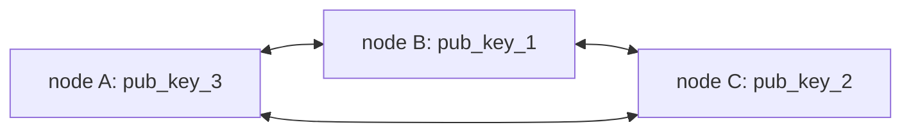

# Durable, distributed, universal task queue for OLTP systems

# Abstract


# Introduction

Quite often nowadays software engineers spend a lot of their time on solving "durable execution" problem. 
Meaning - they don't write code that solves business problems, they write code that solves "infrastructure problems". Like: retries, idempotencyID checks, DLQs, etc
So here we provide the architecture on how to build such a universal system. That will be durable and can be used in many different OLTP scenarious.

We can say that almost any modern distributed event-based system is a task queue. But any time it is built it is built from some building blocks from zero. Lost of human resources are spent on keeping it up and running and providing the proper abstractions, so feature teams can deliver their features quickly.

So the idea is to make a universal solution that will be durable, easy to Ops and feature teams don't need to think about what happens underneath. They need to think only about implementing features, and they can be sure their features will be executed.

# High level design

parts:
- distributed nodes
- consensus
- transactions
- sequence IDs assigner
- DSL
- gateways
- on failures


# Main objectives
- durable, distributed, universal task queue for OLTP systems


# Nodes order
let's say we want to write each 1/16 of second.
What we're going to do:
we have 5 nodes: A,B,C,D,E
Then through etcd we don't need to have a leader, we need to have an order. Ex:

B,C,A,D,E. Which means: Each 1/16 of second B tries to write it's order. If at 1/16 it won't write anything - Next node will try to write at the next(TODO: not exactly next but some reasonable) tick(at 2/16). If that one will be unsuccessfull as well - the next one, until it will write and from that point it will become the "leader" - Not really a leader. Just the "first writer"

### Ex:
#### terminology
- order: B,C,A,D,E
- ticks
    - tick: 1/16
    - t3 == tick number 3 ~=> 3/16 second from 0
    - t3~ == shortly after tick number 3
#### example scenario
|time|event|
|-|-|
|t1|B fixed sequence|
|t1~| A,D,E got update, reset timers, but not C|
|t2|B fixed sequence|
|t2~| A,D,E got update, reset timers but not C|
|t3|B fixed sequence|
|t3| C thinks B crashed and tries to fix sequence(since it's C's order), failed attempt, reset counter|
|t3~| C,A,D,E got update, reset timers|
|t3~| B crashed|
|t4|nobody tries to write|
|t5| C's order - tries to fix sequence. Success.|
|t5~| D,E got update, reset timers but not A|
|t6| A thinks that C crashed, so tries to fix the sequence - unsuccessfull, reset counter|
|t6| C fixes sequence|


### How to ensure the order 
1. node gets all nodes in "/node" (the exact prefix might be different in the implementation)
    1.1. sort nodes and find itself
    1.2. if it found itself - that's the current index. Stop here
    1.3. if not found - go next
2. from /node/{number} - uses number as an index, gets the {latest}
3. tries to create a record with the lease: "/node/{latest +1}". If unsuccessfull jump to step 1


```
// TODO: maybe only one key? Don't store any history??
k /all
    /33
        /{writer: node1, seq: 33, value: Map<RangeKey, RangeValue>}
    /34
        /{writer: node1, seq: 34, value: Map<RangeKey, RangeValue>}

k /allnodes/
v [id4, id12321, id1, id5] // or IPs or whatever, TODO: Public keys???

0 , 3 ,6 ,9
0 ,3,  , 9

offset: 
```

# ETCD data

|key|value|note|
|-|-|-|
|/latest|{<br>writer: node_key,<br>seq: seq_number<br>}||
|/registeredNodes|[nodes public keys]|nodes that registered their public keys.<br>It doesn't mean all these nodes are healthy and running|
|/log|{<br>writer: node_key,<br>seq: seq_number,<br>increment: Map<RangeKey, RangeValue><br>}|on rotation base. Keeps only last N records. Finit and short (10/100/1000 not defined yet)|

# Nodes order
## terminology

- `tick` [t0] - some short period of time where nodes should publish updates to saved operations(durably saved on multiple nodes). Right now we're thinking about having tick = 1/16 seconds. But that number is not written in stone and can vary in the future.


## principle

We don't really have an order or leader election.
We want the system to write updates each tick.
We introduce a concept of node delay.
In a classical system you have the leader and if leader crashes - you need to go through election process which takes time.
We want to go the other way:
nodes determenistically decide in which order they should "publish" an update. And if the first node - publishes, everything goes well. We don't need to adjust anything.
But if the first node doesn't publish - next nodes should take that job.
We introduce `delay` concept. Each node knows who is the first one and which delay it should have after the first node.

## algorithm of defining delays

- nodes append to `/registeredNodes` their public keys
    - Why do we need this? If that's not reliable?
    - the only reason I see - in order to have some "trust" that this node

- nodes make dircet p2p connection in order to maintain the health + exchange the transactions
- node has connections with the other nodes and node knows their public keys
- next, node takes these public keys, hashes them and by doing this understands the order they should go in. It's circular. Then depends on who was the last node to write to `/latest` - it becomes the starter. And everybody else adds up some delay depends on the order in that hashed ring.
- There might be collisions if two nodes not connected and both think they should go in the same order. Well - first writer vins and becomes the first in the ring.


## visualisation examples

### basic scenario

nodes maintain the connections between each other


So, you have a ring of keys: [pub_key_1, pub_key_2, pub_key3]
In the beginning when nodes start and nobody has written anything (`/latest` is empty) delay starts from pub_key_1. 
So:
- node B has delay 0 ticks
- node C has delay 3 ticks
    - number is an example and can be tuned in the specific system's installation
- node A has delay 6 ticks

Each time 